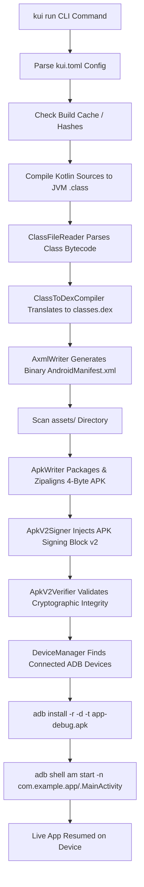

# KUI Architecture & Engineering Blueprint

This document specifies the technical architecture of the KUI platform, detailing its core subsystems, execution pipelines, data representations, and performance characteristics.

---

## 🏗️ Architectural Layers

KUI is organized into two primary subsystems:
1. **Platform Toolchain (`platform/kui/`)**: The build, packaging, signing, and device execution system.
2. **UI4 Runtime Engine (`platform/ui4/`)**: The declarative UI layout, rendering, input, and state management system.

```
┌────────────────────────────────────────────────────────────────────────┐
│                        User Application (src/)                         │
│                  Declarative UI4 DSL & App Logic                      │
└──────────────────────────────────┬─────────────────────────────────────┘
                                   │
┌──────────────────────────────────┴─────────────────────────────────────┐
│                          UI4 Runtime Engine                            │
│  ┌───────────────────────┐  ┌─────────────────┐  ┌──────────────────┐  │
│  │ Tree & Node System    │  │ 2-Pass Layout   │  │ Reactive State   │  │
│  │ (UiRoot, Column, etc.)│  │ Measure/Layout  │  │ Dirty Tracking   │  │
│  └───────────────────────┘  └─────────────────┘  └──────────────────┘  │
│  ┌───────────────────────┐  ┌─────────────────┐  ┌──────────────────┐  │
│  │ Render Pipeline       │  │ Input & Focus   │  │ Gestures & Anim  │  │
│  │ (RecordingCanvas)     │  │ FocusManager    │  │ Spring / Tween   │  │
│  └───────────────────────┘  └─────────────────┘  └──────────────────┘  │
│  ┌──────────────────────────────────────────────────────────────────┐  │
│  │ Universal Surface Host (VirtualHost / AndroidHostBridge)         │  │
│  └──────────────────────────────────────────────────────────────────┘  │
└──────────────────────────────────┬─────────────────────────────────────┘
                                   │ JVM Class Bytecode
┌──────────────────────────────────┴─────────────────────────────────────┐
│                         KUI Platform Toolchain                         │
│  ┌───────────────────────┐  ┌─────────────────┐  ┌──────────────────┐  │
│  │ CLI & Dispatcher      │  │ Project Config  │  │ Build Cache      │  │
│  │ (kui build/run/test)  │  │ (kui.toml)      │  │ SHA-256 Hashing  │  │
│  └───────────────────────┘  └─────────────────┘  └──────────────────┘  │
│  ┌───────────────────────┐  ┌─────────────────┐  ┌──────────────────┐  │
│  │ Kotlinc Driver        │  │ ClassFileReader │  │ ClassToDex       │  │
│  │ (Direct Invocation)   │  │ ConstantPool    │  │ Pure Dalvik/DEX  │  │
│  └───────────────────────┘  └─────────────────┘  └──────────────────┘  │
│  ┌───────────────────────┐  ┌─────────────────┐  ┌──────────────────┐  │
│  │ AxmlWriter & Manifest │  │ ApkWriter       │  │ ApkV2Signer      │  │
│  │ Binary XML Emission   │  │ 4-Byte Align    │  │ APK Sig v2 (RSA) │  │
│  └───────────────────────┘  └─────────────────┘  └──────────────────┘  │
│  ┌──────────────────────────────────────────────────────────────────┐  │
│  │ DeviceManager (ADB Client, Serial Discovery, Install, Run)       │  │
│  └──────────────────────────────────────────────────────────────────┘  │
└────────────────────────────────────────────────────────────────────────┘
```

---

## 🔄 End-to-End Build & Run Pipeline

When a user or CI runner executes `kui run` (or `kui build`), the orchestrator (`PackagingTask.kt` / `BuildCommand.kt`) executes the following sequential pipeline:



### Stage 1: Configuration & Cache Resolution
- `ConfigParser.kt` parses `kui.toml` extracting project name, package name, version, and Android SDK constraints (`minSdk`, `targetSdk`).
- `BuildCache.kt` computes SHA-256 hashes of all source files, assets, and config. If unchanged, compilation is skipped (`UP-TO-DATE`).

### Stage 2: Kotlin Source Compilation
- `KotlincDriver.kt` launches the standalone Kotlin compiler (`kotlinc`) directly against `src/` targeting JVM bytecode.
- Output `.class` files are placed into `.kui/build/classes/`.

### Stage 3: Bytecode to Dalvik Translation (Pure Kotlin DEX)
- `ClassFileReader.kt` reads JVM classfiles, decoding magic `0xCAFEBABE`, versions, constant pool items, access flags, fields, methods, and `Code` attributes.
- `ClassToDexCompiler.kt` translates JVM classes into Dalvik `DexClass` representations:
  - Registers allocation for local variables and incoming parameters.
  - Opcode mapping (returns, invokes, consts, allocations).
  - Constructor verification enforcement: guarantees every `<init>` invokes `super.<init>()` (`invoke-direct {v0}`).
  - Dynamic `MainActivity` synthesis: if no custom activity exists, generates an Activity subclass with `onCreate(Bundle)` displaying the root UI.
- `DexModel.kt` builds the binary `classes.dex`:
  - Collects and sorts strings, types, prototypes (`computeShorty`), and method IDs.
  - Resolves symbolic instruction fixups (`DexInstructionFixup.MethodRef`, `TypeRef`, `StringRef`).
  - Serializes strings using **Modified UTF-8 (`encodeMutf8`)** preventing surrogate rejection on ART.
  - Emits sorted `map_list` (`0x1000`) and properly aligned data sections.
  - Patches SHA-1 signature and Adler-32 checksums in the header.

### Stage 4: Binary AndroidManifest.xml Generation
- `ManifestGenerator.kt` constructs the standard Android XML schema tree.
- `AxmlWriter.kt` emits Android binary XML:
  - `RES_XML_TYPE` (`0x0003`) header.
  - `RES_STRING_POOL_TYPE` (`0x0001`) with UTF-8 flag.
  - `RES_XML_RESOURCE_MAP_TYPE` (`0x0180`) mapping system attribute IDs (`0x0101021b`, `0x0101020c`, etc.).
  - Standard 20-byte attribute structs with exact chunk offsets.

### Stage 5: 4-Byte Zipaligned APK Packaging
- `ApkWriter.kt` creates the ZIP archive:
  - `classes.dex` stored uncompressed (`STORED = 0`) aligned to a 4-byte offset in the file for memory mapping (`mmap`) by ART.
  - `AndroidManifest.xml` stored uncompressed.
  - Assets in `assets/` compressed via `DEFLATE = 8` or stored based on compression savings.
  - End of Central Directory (EOCD) record emitted.

### Stage 6: APK Signature Scheme v2 Signing
- `ApkV2Signer.kt` signs the binary APK using the v2 signature scheme:
  - Obtains or generates an RSA 2048-bit key pair and self-signed X.509 certificate.
  - Keys are persisted to `~/.kui/debug.pk8` and `~/.kui/debug.crt` ensuring continuous update compatibility (`INSTALL_FAILED_UPDATE_INCOMPATIBLE` prevention).
  - Splits APK into 1MB chunks across Section 1 (ZIP entries) and Section 3 (Central Directory).
  - Calculates SHA-256 chunk digests and root digest.
  - Signs root digest with RSA-SHA256 (`SHA256withRSA`).
  - Injects the APK Signing Block immediately before the Central Directory (Section 2), updating the EOCD central directory offset.
- `ApkV2Verifier.kt` verifies cryptographic validity before deployment.

### Stage 7: ADB Discovery & Launch
- `DeviceManager.kt` queries `adb devices -l` to discover connected emulators and physical hardware over USB/Wi-Fi.
- Selects target device (or user-specified serial via `--device`).
- Executes `adb install -r -d -t build/outputs/apk/debug/app-debug.apk` (allowing reinstall, downgrade, and test packages).
- Launches activity via `adb shell am start -n <package>/.MainActivity`.
