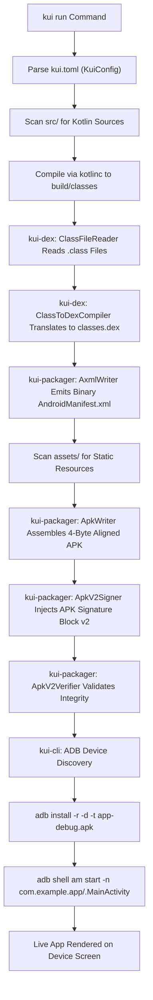

# 🏗️ KUI Architecture & Systems Blueprint

This document specifies the technical architecture of the KUI platform, detailing its core subsystems, execution pipelines, data representations, and performance characteristics.

---

## 🏛️ Architectural Layers

KUI employs a dual-layer architecture separating systems-level toolchain execution from declarative UI rendering:

```
┌────────────────────────────────────────────────────────────────────────┐
│                        User Application (src/)                         │
│                    Declarative UI4 DSL & App Logic                     │
└──────────────────────────────────┬─────────────────────────────────────┘
                                   │
┌──────────────────────────────────┴─────────────────────────────────────┐
│                 Layer 1: UI4 Declarative Engine (Kotlin)               │
│  ┌───────────────────────┐  ┌─────────────────┐  ┌──────────────────┐  │
│  │ Tree & Node System    │  │ 2-Pass Layout   │  │ Reactive State   │  │
│  │ (UiRoot, Column, etc.)│  │ Measure/Layout  │  │ Dirty Tracking   │  │
│  └───────────────────────┘  └─────────────────┘  └──────────────────┘  │
│  ┌───────────────────────┐  ┌─────────────────┐  ┌──────────────────┐  │
│  │ Render Pipeline       │  │ Input & Focus   │  │ Gestures & Anim  │  │
│  │ (RecordingCanvas)     │  │ FocusManager    │  │ Spring / Tween   │  │
│  └───────────────────────┘  └─────────────────┘  └──────────────────┘  │
└──────────────────────────────────┬─────────────────────────────────────┘
                                   │ JVM Class Bytecode (.class)
┌──────────────────────────────────┴─────────────────────────────────────┐
│                 Layer 2: Native Systems Toolchain (Rust)               │
│  ┌──────────────────────────────────────────────────────────────────┐  │
│  │ kui-cli (crates/kui-cli)                                         │  │
│  │ • Command Parser & Sub-5ms Dispatcher                            │  │
│  │ • Environment Doctor (JDK 21, kotlinc, ADB diagnostics)          │  │
│  │ • DeviceManager (ADB query, install, am start)                   │  │
│  └───────────────────────────────┬──────────────────────────────────┘  │
│                                  │                                     │
│  ┌───────────────────────────────┴──┐  ┌────────────────────────────┐  │
│  │ kui-dex (crates/kui-dex)         │  │ kui-packager               │  │
│  │ • ClassFileReader (CAFEBABE)     │  │ (crates/kui-packager)      │  │
│  │ • DexFileBuilder (MUTF-8, LEB128)│  │ • AxmlWriter (Binary XML)  │  │
│  │ • Opcode Translator              │  │ • ApkWriter (4-byte align) │  │
│  │ • Adler-32 / SHA-1 Checksums     │  │ • ApkV2Signer (RSA-2048)   │  │
│  └──────────────────────────────────┘  └────────────────────────────┘  │
└──────────────────────────────────┬─────────────────────────────────────┘
                                   │ 4-Byte Aligned, v2-Signed APK
                                   ▼
                    Android Device / Emulator (ART)
```

---

## 🔄 End-to-End Build & Run Pipeline

When a developer executes `kui run` (or `kui build`), KUI orchestrates the following sequential pipeline:



---

## ⚙️ Detailed Pipeline Stages

### Stage 1: Configuration Resolution (`kui-cli::config`)
* `KuiConfig::load_from_file` parses `kui.toml` using Rust's `toml` parser.
* Extracts `name`, `version`, `application_id`, `min_sdk` (default 24), and `target_sdk` (default 36).

### Stage 2: Kotlin Source Compilation
* Locates standalone `kotlinc` on host system.
* Spawns `kotlinc` with source paths and output directory set to `build/classes/`.

### Stage 3: Pure Rust DEX Compilation (`kui-dex`)
* `ClassFileReader` parses compiled `.class` files:
  * Verifies magic `0xCAFEBABE`.
  * Decodes 1-indexed constant pool entries (Utf8, Class, Methodref, Fieldref, NameAndType, InvokeDynamic, Long, Double).
  * Parses method `Code` attributes, maximum stack, maximum locals, instruction bytecode arrays, and exception tables.
* `ClassToDexCompiler` translates JVM structures into Dalvik `DexClass` models:
  * Allocates local and parameter registers.
  * Translates returns (`return-void`, `return`, `return-object`).
  * Enforces Dalvik constructor supercalls (`invoke-direct {v0} SuperClass.<init>()`).
  * Synthesizes `MainActivity` with live UI layout (`TextView`, centered gravity, custom text size).
* `DexFileBuilder` serializes the binary `classes.dex`:
  * MUTF-8 string pool with UTF-16 surrogate pairs (`encode_mutf8`).
  * Section layout: `string_ids`, `type_ids`, `proto_ids`, `field_ids`, `method_ids`, `class_defs`.
  * Differential ULEB128 encoding of fields and methods.
  * 4-byte memory alignment for code items and type lists.
  * RFC 1950 Adler-32 checksum (bytes 12..end) and SHA-1 cryptographic signature (bytes 32..end).

### Stage 4: Binary AndroidManifest.xml Generation (`kui-packager::axml`)
* `ManifestGenerator` and `AxmlWriter` serialize pure binary Android XML:
  * Chunk headers: `RES_XML_TYPE` (`0x0003`).
  * String pool: UTF-16 formatted with system namespace URIs.
  * Resource map: `RES_XML_RESOURCE_MAP_TYPE` (`0x0180`) with Android attribute IDs (`minSdkVersion: 0x0101020c`, `targetSdkVersion: 0x01010270`, etc.).
  * Exact 20-byte XML attribute structs.

### Stage 5: 4-Byte Aligned APK Construction (`kui-packager::apk`)
* `ApkWriter` writes a standard ZIP archive containing:
  * `AndroidManifest.xml` (uncompressed, 4-byte aligned).
  * `classes.dex` (uncompressed, 4-byte aligned for immediate mmap loading by ART).
  * Bundled assets under `assets/`.
* Calculates exact extra-field null padding: `((header_offset + header_size + filename_len + extra_len) % 4) == 0`.

### Stage 6: APK Signature Scheme v2 (`kui-packager::signing`)
* Splits ZIP archive into three distinct sections:
  1. ZIP Entries Data.
  2. Central Directory.
  3. End of Central Directory (EoCD).
* Computes 1MB chunked 2-level SHA-256 tree digests over all three sections.
* Pure Rust RSA-2048 signing (`SHA256withRSA`).
* Generates self-signed X.509 v3 debug certificate cached in `~/.kui/debug.crt`.
* Constructs APK Signing Block (`APK Sig Block 42`, ID `0x7109871a`) and injects it between ZIP Entries and Central Directory.
* `ApkV2Verifier` validates tamper-evident tree digests.

### Stage 7: Device Deployment & Execution (`kui-cli::device`)
* Discovers connected Android devices via ADB client.
* Streams the APK to the target device via `adb install -r -d -t app-debug.apk`.
* Starts the application activity using `adb shell am start -n <package>/<activity>`.
